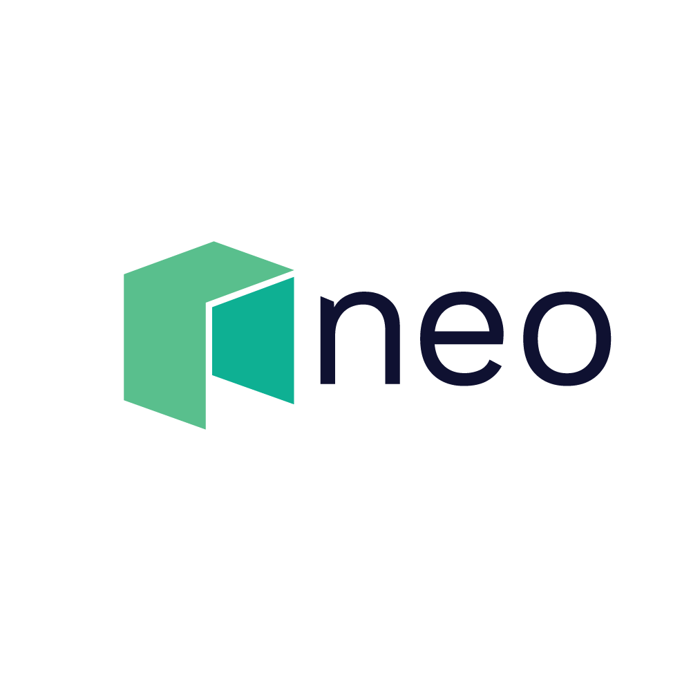

# NeoRust

<div align="center">
  <p>
    &nbsp;&nbsp;&nbsp;&nbsp;
    &nbsp;&nbsp;&nbsp;&nbsp;
    
  </p>
</div>

[](https://github.com/R3E-Network/NeoRust/actions/workflows/rust.yml)
[](https://crates.io/crates/neo3)
[](https://docs.rs/neo3)
[](https://opensource.org/licenses/MIT)
[](https://opensource.org/licenses/Apache-2.0)

NeoRust is a comprehensive Rust SDK for interacting with the Neo N3 blockchain, providing developers with a type-safe, intuitive interface for building Neo applications.

## Overview

NeoRust is a Rust SDK designed to simplify interaction with the Neo N3 blockchain. It provides a rich set of features including wallet management, transaction building, and smart contract interactions.

## Features

NeoRust uses a flexible feature flag system to allow you to include only the functionality you need. This helps reduce compile times and binary sizes by only including what your application requires.

### Core Features

- `std`: Standard library support (enabled by default)
- `crypto-standard`: Cryptographic primitives for Neo N3 (enabled by default)

### Transport Layers

- `http-client`: HTTP client for communicating with Neo N3 nodes via JSON-RPC
- `websocket`: WebSocket client for real-time updates and event subscription  
- `rest-client`: RESTful API client for Neo N3 nodes

### Hash Functions

- `ripemd160`: RIPEMD-160 hash function for address generation
- `sha2`: SHA2 hash functions
- `digest`: Core digest traits for hash functions

### Blockchain Features

- `transaction`: Transaction creation, signing and broadcasting
- `wallet`: Wallet management functionality including NEP-6 format
- `contract`: Smart contract interaction and deployment
- `ethereum-compat`: Ethereum compatibility layer

### Runtime Dependencies

- `tokio`: Asynchronous runtime for non-blocking operations

## Installation

Add NeoRust to your Cargo.toml:

```toml
[dependencies]
neo3 = "0.1.3"
```

To enable all features:

```toml
[dependencies]
neo3 = { version = "0.1.3", features = ["crypto-standard", "transaction", "std"] }
```

## Quick Start

```rust
use neo3::prelude::*;
use neo3::neo_utils::network::NeoNetwork;

#[tokio::main]
async fn main() -> Result<(), Box<dyn std::error::Error>> {
    // Connect to Neo TestNet
    let client = NeoNetwork::TestNet.create_client()?;
    
    // Get blockchain information
    let block_count = client.get_block_count().await?;
    println!("Current block height: {}", block_count);
    
    // Check NEO token balance
    let address = "NVkg1yRMrTyY6QFnEkpP4WUFaviE1gFa3g";
    let neo_token = NetworkToken::new(NeoNetwork::TestNet, "neo")?;
    let (balance, symbol, decimals) = neo_token.balance_of(address).await?;
    
    println!("NEO Balance: {} {}", 
        neo_token.format_balance(balance, decimals), 
        symbol
    );
    
    Ok(())
}
```

## Documentation

For detailed documentation, visit [docs.neorust.org](https://docs.neorust.org) or check the `docs` directory.

## Examples

The `examples` directory contains sample code demonstrating various SDK features:

- Wallet operations
- Transaction building and sending
- Smart contract invocation
- Token transfers
- Network switching between MainNet and TestNet
- NeoFS storage operations

## Network Support

NeoRust provides built-in support for working with different Neo N3 networks:

```rust
// Connect to MainNet
let mainnet_client = NeoNetwork::MainNet.create_client()?;

// Connect to TestNet
let testnet_client = NeoNetwork::TestNet.create_client()?;

// Configure a custom network
let private_net = NetworkBuilder::new(NeoNetwork::PrivateNet)
    .endpoints(vec!["http://localhost:10332".to_string()])
    .magic(5195086)
    .build_client()?;
```

## Feature Flags

NeoRust uses feature flags to control which components are included:

- `crypto-standard`: Core cryptographic operations
- `transaction`: Transaction building and signing
- `std`: Standard library support
- `ethereum-compat`: Neo X / Ethereum compatibility
- `ledger`: Hardware wallet support

## License

This project is licensed under the MIT License - see the LICENSE file for details.

## Contributing

Contributions are welcome! Please see CONTRIBUTING.md for details on how to contribute.

## Acknowledgements

NeoRust is built on top of other Rust crypto libraries and is inspired by ethers-rs and neo-go.

This project is maintained by the R3E Network team.

## Running Tests with VPN

If you're running tests on a machine with a VPN connection, you may encounter issues with the mock server connections used in tests. This is because VPNs can intercept or redirect network traffic, which affects even local mock servers.

NeoRust now features automatic VPN detection! When a VPN is detected, tests will automatically switch to offline mode without requiring any manual configuration.

You can still manually control this behavior using the environment variable:

```bash
# Force tests to run in offline mode (no network connections)
NEORUST_OFFLINE_TESTS=1 cargo test

# Force tests to run in regular mode (with local mock server)
NEORUST_OFFLINE_TESTS=0 cargo test

# Alternatively, for Windows PowerShell
$env:NEORUST_OFFLINE_TESTS=1
cargo test

# Windows Command Prompt
set NEORUST_OFFLINE_TESTS=1
cargo test
```

The offline mode uses in-memory mocks instead of a local HTTP server, which makes tests work reliably with a VPN. This mode is also useful for:

- Environments with restricted network access
- CI/CD pipelines
- Offline development environments
- Improving test speed by avoiding network setup

### VPN Detection Details

The automatic VPN detection feature works across multiple platforms:

- **macOS**: Detects VPN connections by checking network services and routing tables
- **Windows**: Looks for VPN adapters in network configurations
- **Linux**: Examines network interfaces and running processes

When a VPN is detected, you will see a console message informing you that tests are running in offline mode.

## Using Features

To use NeoRust with specific features, add them to your Cargo.toml:

```toml
[dependencies]
neo3 = { version = "0.1.3", features = ["http-client", "transaction"] }
```

### Common Feature Combinations

1. **Basic JSON-RPC client**
   ```toml
   neo3 = { version = "0.1.3", features = ["http-client"] }
   ```

2. **Full wallet and transaction support**
   ```toml
   neo3 = { version = "0.1.3", features = ["http-client", "wallet", "transaction"] }
   ```

3. **Smart contract interaction**
   ```toml
   neo3 = { version = "0.1.3", features = ["contract"] }
   ```
   
4. **Real-time blockchain events**
   ```toml
   neo3 = { version = "0.1.3", features = ["websocket"] }
   ```

## Feature Compatibility

Not all features are compatible with each other due to design constraints. Here's a compatibility matrix:

| Feature        | Requires                                 | Notes                                      |
|----------------|------------------------------------------|-------------------------------------------|
| `http-client`  | -                                        | Core JSON-RPC client                       |
| `websocket`    | `tokio`                                  | Real-time event subscriptions              |
| `transaction`  | `crypto-standard`                        | Transaction creation and signing           |
| `wallet`       | `crypto-standard`                        | Wallet management                          |
| `contract`     | `http-client`, `transaction`             | Smart contract interactions                |

## Example Usage

```rust
use neo::prelude::*;

#[tokio::main]
async fn main() -> Result<(), Box<dyn std::error::Error>> {
    // Create an HTTP provider connected to a Neo N3 TestNet node
    let provider = HttpProvider::new("https://testnet1.neo.org:443")?;
    
    // Create an RPC client with the provider
    let client = RpcClient::new(provider);
    
    // Get the current block count
    let block_count = client.get_block_count().await?;
    println!("Current block count: {}", block_count);
    
    Ok(())
}
```
