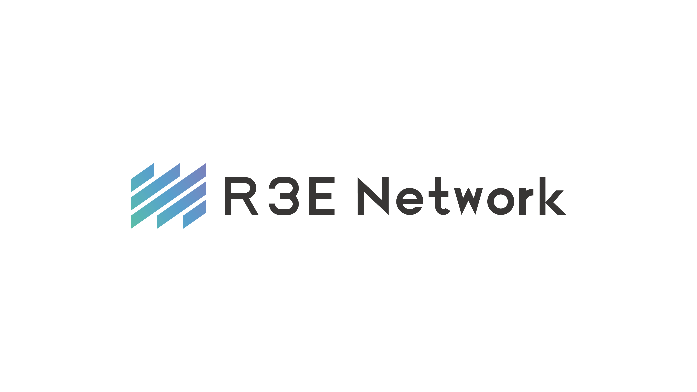

# NeoRust

<div align="center">
  <p>
    &nbsp;&nbsp;&nbsp;&nbsp;
    &nbsp;&nbsp;&nbsp;&nbsp;
    
  </p>
</div>

[](https://github.com/R3E-Network/NeoRust/actions/workflows/rust.yml)
[](https://crates.io/crates/neo3)
[](https://docs.rs/neo3)
[](https://opensource.org/licenses/MIT)
[](https://opensource.org/licenses/Apache-2.0)

NeoRust is a comprehensive Rust SDK for interacting with the Neo N3 blockchain. It provides a complete set of tools and utilities for building applications on the Neo ecosystem, including wallet management, transaction creation, smart contract interaction, and more.

## Features

- **Complete Neo N3 Support**: Full compatibility with the Neo N3 blockchain protocol
- **Wallet Management**: Create, manage, and secure Neo wallets with support for NEP-6 standard
- **Transaction Building**: Construct and sign various transaction types
- **Smart Contract Interaction**: Deploy and interact with smart contracts
- **RPC Client**: Connect to Neo nodes via JSON-RPC
- **NEP-17 Token Support**: Interact with NEP-17 compatible tokens
- **Neo Name Service (NNS)**: Resolve and manage domain names on the Neo blockchain
- **Cryptographic Operations**: Secure key management and cryptographic functions
- **Modular Architecture**: Well-organized codebase with clear separation of concerns
- **Famous Neo N3 Contracts**: Direct support for popular Neo N3 contracts like Flamingo Finance, NeoburgerNeo, GrandShare, and NeoCompound
- **Neo X Support**: EVM compatibility layer and bridge functionality for Neo X, an EVM-compatible chain maintained by Neo

## Installation

Add neo3 to your `Cargo.toml`:

```toml
[dependencies]
neo3 = "0.1.3"
```

Note: The crate is published as `neo3` but is imported as `neo` in code:

```rust
use neo::prelude::*;
```

You can also specify features if needed:

```toml
[dependencies]
neo3 = { version = "0.1.2", features = ["ledger", "aws", "futures"] }
```

For the latest development version, you can use the Git repository:

```toml
[dependencies]
neo3 = { git = "https://github.com/R3E-Network/NeoRust.git" }
```

### Documentation

Comprehensive documentation is available at:

- **API Reference**: [https://docs.rs/neo3](https://docs.rs/neo3)
- **Online Documentation**: [https://r3e-network.github.io/NeoRust/](https://r3e-network.github.io/NeoRust/)
- **Crate Page**: [https://crates.io/crates/neo3](https://crates.io/crates/neo3)

## Quick Start

```rust
use neo::prelude::*;

#[tokio::main]
async fn main() -> Result<(), Box<dyn std::error::Error>> {
    // Connect to Neo N3 TestNet
    let provider = HttpProvider::new("https://testnet1.neo.org:443")?;
    let client = RpcClient::new(provider);
    
    // Get blockchain information
    let block_count = client.get_block_count().await?;
    println!("Current block height: {}", block_count);
    
    // Create a new wallet
    let wallet = Wallet::new();
    println!("New wallet created with address: {}", 
             wallet.default_account().address_or_scripthash().address());
    
    Ok(())
}
```

## Usage Examples

### Connecting to Neo Nodes

```rust
use neo::{
    neo_clients::{HttpProvider, JsonRpcProvider},
    prelude::RpcClient,
};

async fn connect_to_nodes() -> Result<(), Box<dyn std::error::Error>> {
    // Connect to MainNet
    let mainnet_provider = HttpProvider::new("https://mainnet1.neo.org:443")?;
    let mainnet_client = RpcClient::new(mainnet_provider);
    
    // Connect to TestNet
    let testnet_provider = HttpProvider::new("https://testnet1.neo.org:443")?;
    let testnet_client = RpcClient::new(testnet_provider);
    
    // Get blockchain information
    let block_count = testnet_client.get_block_count().await?;
    let latest_block_hash = testnet_client.get_best_block_hash().await?;
    
    Ok(())
}
```

### Wallet Management

```rust
use neo::{
    neo_protocol::account::Account,
    neo_wallets::{Wallet, WalletBackup, WalletTrait},
    prelude::{NeoNetwork, ScryptParamsDef},
};

async fn manage_wallets() -> Result<(), Box<dyn std::error::Error>> {
    // Create a new wallet
    let mut wallet = Wallet::new();
    
    // Configure wallet properties
    wallet.set_name("MyNeoWallet".to_string());
    let wallet = wallet.with_network(NeoNetwork::TestNet.to_magic());
    
    // Create and add a new account
    let new_account = Account::create()?;
    let mut wallet = wallet;
    wallet.add_account(new_account.clone());
    
    // Encrypt accounts in the wallet
    wallet.encrypt_accounts("password123");
    
    // Backup and recover wallet
    let backup_path = std::path::PathBuf::from("wallet_backup.json");
    WalletBackup::backup(&wallet, backup_path.clone())?;
    let recovered_wallet = WalletBackup::recover(backup_path)?;
    
    Ok(())
}
```

### Creating and Sending Transactions

```rust
use neo::{
    neo_clients::{HttpProvider, JsonRpcProvider},
    neo_builder::transaction::{Transaction, TransactionBuilder},
    neo_protocol::account::Account,
    prelude::{RpcClient, Signer, WalletTrait},
};

async fn create_transaction() -> Result<(), Box<dyn std::error::Error>> {
    // Connect to TestNet
    let provider = HttpProvider::new("https://testnet1.neo.org:443")?;
    let client = RpcClient::new(provider);
    
    // Create accounts
    let sender = Account::create()?;
    let receiver = Account::create()?;
    
    // Build a transfer transaction
    let tx = TransactionBuilder::new()
        .version(0)
        .nonce(1234)
        .valid_until_block(client.get_block_count().await? + 100)
        .sender(sender.get_script_hash())
        .receiver(receiver.get_script_hash())
        .system_fee(1000000)
        .network_fee(1000000)
        .build();
    
    // Sign and send the transaction
    let signed_tx = tx.sign(&sender).await?;
    let tx_hash = client.send_raw_transaction(signed_tx).await?;
    
    Ok(())
}
```

### Interacting with Smart Contracts

```rust
use neo::{
    neo_clients::{HttpProvider, JsonRpcProvider},
    neo_contract::{ContractManagement, SmartContract},
    neo_types::contract::{ContractParameter, ContractParameterType},
    prelude::{RpcClient, Signer},
};

async fn interact_with_contract() -> Result<(), Box<dyn std::error::Error>> {
    // Connect to TestNet
    let provider = HttpProvider::new("https://testnet1.neo.org:443")?;
    let client = RpcClient::new(provider);
    
    // Load a contract by its script hash
    let contract_hash = "0xef4073a0f2b305a38ec4050e4d3d28bc40ea63f5".parse()?;
    let contract = SmartContract::new(contract_hash, client.clone());
    
    // Call a read-only method
    let result = contract.call_function("balanceOf", vec![
        ContractParameter::new_hash160("NZNos2WqTbu5oCgyfss9kUJgBXJqhuYAaj".parse()?)
    ]).await?;
    
    // Invoke a contract method that changes state
    let account = Account::create()?;
    let invoke_result = contract.invoke(
        "transfer",
        vec![
            ContractParameter::new_hash160(account.get_script_hash()),
            ContractParameter::new_hash160("NZNos2WqTbu5oCgyfss9kUJgBXJqhuYAaj".parse()?),
            ContractParameter::new_integer(1000),
            ContractParameter::new_any(None),
        ],
        account,
    ).await?;
    
    Ok(())
}
```

### Working with NEP-17 Tokens

```rust
use neo::{
    neo_clients::{HttpProvider, JsonRpcProvider},
    neo_contract::Nep17Contract,
    neo_protocol::account::Account,
    prelude::{RpcClient, Signer},
};

async fn work_with_nep17_tokens() -> Result<(), Box<dyn std::error::Error>> {
    // Connect to TestNet
    let provider = HttpProvider::new("https://testnet1.neo.org:443")?;
    let client = RpcClient::new(provider);
    
    // Create an account
    let account = Account::create()?;
    
    // Connect to a NEP-17 token contract (e.g., NEO)
    let neo_token_hash = "0xef4073a0f2b305a38ec4050e4d3d28bc40ea63f5".parse()?;
    let neo_token = Nep17Contract::new(neo_token_hash, client.clone());
    
    // Get token information
    let symbol = neo_token.symbol().await?;
    let decimals = neo_token.decimals().await?;
    let total_supply = neo_token.total_supply().await?;
    
    // Get account balance
    let balance = neo_token.balance_of(account.get_script_hash()).await?;
    
    // Transfer tokens
    let recipient = "NZNos2WqTbu5oCgyfss9kUJgBXJqhuYAaj".parse()?;
    let transfer_result = neo_token.transfer(
        account.clone(),
        recipient,
        1000,
        None,
    ).await?;
    
    Ok(())
}
```

### Using Neo Name Service (NNS)

```rust
use neo::{
    neo_clients::{HttpProvider, JsonRpcProvider},
    neo_contract::NameService,
    prelude::{RpcClient, Signer},
};

async fn use_neo_name_service() -> Result<(), Box<dyn std::error::Error>> {
    // Connect to TestNet
    let provider = HttpProvider::new("https://testnet1.neo.org:443")?;
    let client = RpcClient::new(provider);
    
    // Create a NameService instance
    let nns = NameService::new(client);
    
    // Resolve a domain name to a script hash
    let domain = "example.neo";
    let script_hash = nns.resolve(domain).await?;
    println!("Domain {} resolves to: {}", domain, script_hash);
    
    // Get the owner of a domain
    let owner = nns.get_owner(domain).await?;
    println!("Domain {} is owned by: {}", domain, owner);
    
    // Check if a domain is available
    let is_available = nns.is_available("newdomain.neo").await?;
    println!("Domain is available: {}", is_available);
    
    Ok(())
}
```

### Working with Famous Neo N3 Contracts

```rust
use neo::{
    neo_clients::{HttpProvider, JsonRpcProvider},
    neo_contract::famous::{FlamingoContract, NeoburgerContract, GrandShareContract, NeoCompoundContract},
    neo_protocol::account::Account,
    prelude::{RpcClient, Signer},
};
use std::str::FromStr;

async fn interact_with_famous_contracts() -> Result<(), Box<dyn std::error::Error>> {
    // Connect to MainNet
    let provider = HttpProvider::new("https://mainnet1.neo.org:443")?;
    let client = RpcClient::new(provider);
    
    // Create an account
    let account = Account::create()?;
    
    // Interact with Flamingo Finance
    let flamingo = FlamingoContract::new(Some(&client));
    
    // Get Flamingo swap rate
    let token_a = ScriptHash::from_str("d2a4cff31913016155e38e474a2c06d08be276cf")?; // GAS
    let token_b = ScriptHash::from_str("ef4073a0f2b305a38ec4050e4d3d28bc40ea63f5")?; // NEO
    let swap_rate = flamingo.get_swap_rate(&token_a, &token_b, 1_0000_0000).await?;
    println!("Swap rate: {} NEO per GAS", swap_rate as f64 / 100_000_000.0);
    
    // Interact with NeoburgerNeo (bNEO)
    let neoburger = NeoburgerContract::new(Some(&client));
    
    // Get bNEO exchange rate
    let rate = neoburger.get_rate().await?;
    println!("bNEO exchange rate: {} bNEO per NEO", rate);
    
    // Wrap NEO to bNEO
    let wrap_tx = neoburger.wrap(1, &account).await?;
    
    // Interact with GrandShare
    let grandshare = GrandShareContract::new(Some(&client));
    
    // Submit a proposal
    let proposal_tx = grandshare.submit_proposal(
        "My Proposal",
        "This is a proposal description",
        1000_0000_0000, // 1000 GAS
        &account,
    ).await?;
    
    // Interact with NeoCompound
    let neocompound = NeoCompoundContract::new(Some(&client));
    
    // Get APY for a token
    let gas_token = ScriptHash::from_str("d2a4cff31913016155e38e474a2c06d08be276cf")?;
    let apy = neocompound.get_apy(&gas_token).await?;
    println!("Current APY for GAS: {}%", apy);
    
    Ok(())
}
```

### Using Neo X EVM Compatibility and Bridge

```rust
use neo::{
    neo_clients::{HttpProvider, JsonRpcProvider},
    neo_x::{NeoXProvider, NeoXTransaction, NeoXBridgeContract},
    neo_protocol::account::Account,
    prelude::{RpcClient, Signer, ScriptHash},
};
use primitive_types::H160;
use std::str::FromStr;

async fn use_neo_x() -> Result<(), Box<dyn std::error::Error>> {
    // Connect to Neo N3
    let neo_provider = HttpProvider::new("https://mainnet1.neo.org:443")?;
    let neo_client = RpcClient::new(neo_provider);
    
    // Initialize the Neo X EVM provider
    let neo_x_provider = NeoXProvider::new("https://rpc.neo-x.org", Some(&neo_client));
    
    // Get the chain ID for Neo X
    let chain_id = neo_x_provider.chain_id().await?;
    println!("Neo X Chain ID: {}", chain_id);
    
    // Create an EVM transaction
    let destination = H160::from_str("0x1234567890123456789012345678901234567890")?;
    let data = vec![/* transaction data */];
    let transaction = NeoXTransaction::new(
        Some(destination),
        data,
        0, // Value
        21000, // Gas limit
        20_000_000_000, // Gas price
    );
    
    // Use the Neo X Bridge to transfer tokens between Neo N3 and Neo X
    let bridge = NeoXBridgeContract::new(Some(&neo_client));
    
    // Get the GAS token script hash
    let gas_token = ScriptHash::from_str("d2a4cff31913016155e38e474a2c06d08be276cf")?;
    
    // Get bridge information
    let fee = bridge.get_fee(&gas_token).await?;
    let cap = bridge.get_cap(&gas_token).await?;
    println!("Bridge fee: {} GAS", fee as f64 / 100_000_000.0);
    println!("Bridge cap: {} GAS", cap as f64 / 100_000_000.0);
    
    // Deposit GAS from Neo N3 to Neo X
    let account = Account::create()?;
    let neo_x_address = "0x1234567890123456789012345678901234567890";
    let amount = 1_0000_0000; // 1 GAS
    
    let deposit_tx = bridge.deposit(
        &gas_token,
        amount,
        neo_x_address,
        &account,
    ).await?;
    
    // Withdraw GAS from Neo X to Neo N3
    let neo_n3_address = "NbTiM6h8r99kpRtb428XcsUk1TzKed2gTc";
    
    let withdraw_tx = bridge.withdraw(
        &gas_token,
        amount,
        neo_n3_address,
        &account,
    ).await?;
    
    Ok(())
}
```

## Configuration

NeoRust provides configuration options for different network environments and blockchain parameters:

```rust
use neo::{
    neo_config::{NeoConfig, NeoConstants, NEOCONFIG},
    prelude::NeoNetwork,
};

fn configure_neo() {
    // Access global configuration
    let mut config = NEOCONFIG.lock().unwrap();
    
    // Set network to MainNet
    config.set_network(NeoNetwork::MainNet.to_magic()).unwrap();
    
    // Configure transaction behavior
    config.allows_transmission_on_fault = true;
    
    // Use predefined constants
    let max_tx_size = NeoConstants::MAX_TRANSACTION_SIZE;
    let mainnet_magic = NeoConstants::MAGIC_NUMBER_MAINNET;
    let testnet_magic = NeoConstants::MAGIC_NUMBER_TESTNET;
    
    // Create a custom configuration for MainNet
    let mainnet_config = NeoConfig::mainnet();
}
```

## Available Features

NeoRust provides several optional features that can be enabled in your `Cargo.toml`:

- **std**: Standard library support with basic serialization (enabled by default)
- **crypto-standard**: Cryptographic functionality including hash functions, key pair operations, and signature verification (enabled by default)
- **digest**: Cryptographic digest algorithms
- **sha2**: SHA-2 hash function support
- **ripemd160**: RIPEMD-160 hash function support
- **ledger**: Support for hardware wallets via Ledger devices
- **nightly**: Support for nightly Rust features (used for documentation)

Example of enabling multiple features:

```toml
[dependencies]
neo3 = { version = "0.1.3", features = ["ledger", "crypto-standard"] }
```

## Feature Flag System

NeoRust uses a feature flag system to allow you to include only the functionality you need. This helps reduce compile times, decrease binary sizes, and simplify dependency management.

### Core Feature Groups

The following core feature groups are available:

- **std**: Standard library support with basic serialization (enabled by default)
- **crypto-standard**: Cryptographic functionality including hash functions, key pair operations, and signature verification (enabled by default)

### Cryptography Features

Choose your required level of cryptographic functionality:

- **crypto-standard**: Comprehensive cryptographic functions (enabled by default)
- **sha2**: SHA-2 hash function support
- **ripemd160**: RIPEMD-160 hash function support
- **digest**: Cryptographic digest algorithms

### Other Features

- **ledger**: Support for hardware wallets via Ledger devices
- **nightly**: Support for nightly Rust features (used for documentation)

### Example Usage

In your `Cargo.toml`, specify exactly what features you need:

```toml
# Default features (recommended for most applications)
neo3 = { version = "0.1.3" }

# With hardware wallet support
neo3 = { version = "0.1.3", features = ["ledger"] }

# Minimal build with no cryptography
neo3 = { version = "0.1.3", default-features = false, features = ["std"] }

# Only with standard library support
neo3 = { version = "0.1.3", default-features = false, features = ["std"] }

# Full cryptographic features
neo3 = { version = "0.1.3", features = ["crypto-standard", "ripemd160"] }
```

### Common Feature Combinations

Here are some recommended feature combinations for common use cases:

| Use Case | Recommended Features |
|----------|---------------------|
| Standard Application | Default features (`std`, `crypto-standard`) |
| Minimal Application | `std` only |
| Hardware Wallet Integration | Default features + `ledger` |
| Documentation Build | Default features + `nightly` |
| Custom Cryptography | `std` + specific crypto features (`sha2`, `ripemd160`, `digest`) |

### Performance Benefits

By selecting only the features you need, you can significantly reduce compile times and binary sizes:

| Feature Combination | Approximate Compile Time | Approximate Binary Size |
|---------------------|--------------------------|-------------------------|
| All features | 1m 30s | 7.5 MB |
| Default features | 1m 15s | 6.0 MB |
| Std only | 30s | 1.0 MB |
| Minimal build | 25s | 0.8 MB |

The specific improvements will vary based on your hardware and build configuration.

### Examples

For practical demonstrations of feature flags, see the examples in the [examples/feature_flags](examples/feature_flags) directory:

- [Minimal Wallet Example](examples/feature_flags/minimal_wallet.rs) - Using only wallet and crypto-standard features
- [NEP-17 Token Example](examples/feature_flags/nep17_token.rs) - Working with NEP-17 tokens

### Migration Guide

If you're upgrading from a previous version, please see our [Feature Flag Migration Guide](improvements/migration_guide.md) for details on how to transition to the new feature flag system.

## Build and Test Scripts

NeoRust includes convenient scripts for building and testing with different feature configurations:

### Unix/Linux/MacOS:

```bash
# Build with default configuration
./scripts/build.sh

# Build with specific features
./scripts/build.sh --features ledger,crypto-standard

# Run tests with default features (std,crypto-standard)
./scripts/test.sh

# Run tests and show output
./scripts/test.sh --nocapture
```

### Windows:

```batch
# Build with default configuration
.\scripts\build.bat

# Build with specific features
.\scripts\build.bat --features ledger,crypto-standard

# Run tests with default features (std,crypto-standard)
.\scripts\test.bat
```

For more details on available script options, see the [scripts README](scripts/README.md).

## Project Structure

NeoRust is organized into several modules:

- **neo_builder**: Transaction and script building utilities
- **neo_clients**: Neo node interaction clients (RPC and WebSocket)
- **neo_codec**: Encoding/decoding for Neo-specific data structures
- **neo_config**: Network and client configuration
- **neo_contract**: Smart contract interaction
- **neo_crypto**: Neo-specific cryptographic operations
- **neo_protocol**: Neo network protocol implementation
- **neo_types**: Core Neo ecosystem data types
- **neo_wallets**: Neo asset and account management

## Contributing

Contributions are welcome! Here's how you can contribute to the NeoRust SDK:

1. **Report Issues**: If you find a bug or have a feature request, please create an issue on the [GitHub repository](https://github.com/R3E-Network/NeoRust/issues).

2. **Submit Pull Requests**: If you'd like to contribute code:
   - Fork the repository
   - Create a new branch (`git checkout -b feature/your-feature-name`)
   - Make your changes
   - Run the tests (`./scripts/test.sh`)
   - Commit your changes (`git commit -m 'Add some feature'`)
   - Push to the branch (`git push origin feature/your-feature-name`)
   - Open a Pull Request

3. **Coding Standards**: Please follow the Rust coding standards and include appropriate tests for your changes.

4. **Documentation**: Update the documentation to reflect your changes if necessary.

## Package Status

NeoRust is now available on [crates.io](https://crates.io/crates/neo3) as the `neo3` crate. The latest version is `0.1.3`.

This means you can now easily add it to your Rust projects without having to reference the GitHub repository directly.

## License

This project is licensed under either of
- Apache License, Version 2.0, ([LICENSE-APACHE](LICENSE-APACHE) or http://www.apache.org/licenses/LICENSE-2.0)
- MIT license ([LICENSE-MIT](LICENSE-MIT) or http://opensource.org/licenses/MIT)

at your option.

## Acknowledgments

Supported by [R3E Network](https://github.com/R3E-Network) and [GrantShares](https://grantshares.io/app/details/155b825697b61f9f95292c8e466f6891). Additional support is welcome.

The NeoRust team would like to thank everyone who contributed to reaching the milestone of publishing the neo3 crate to crates.io.
