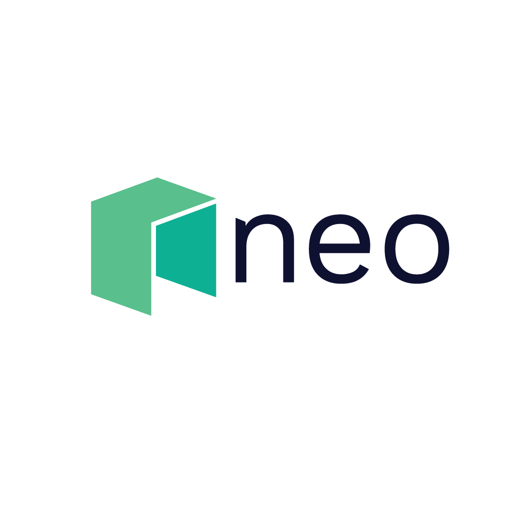
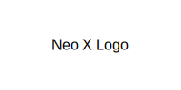
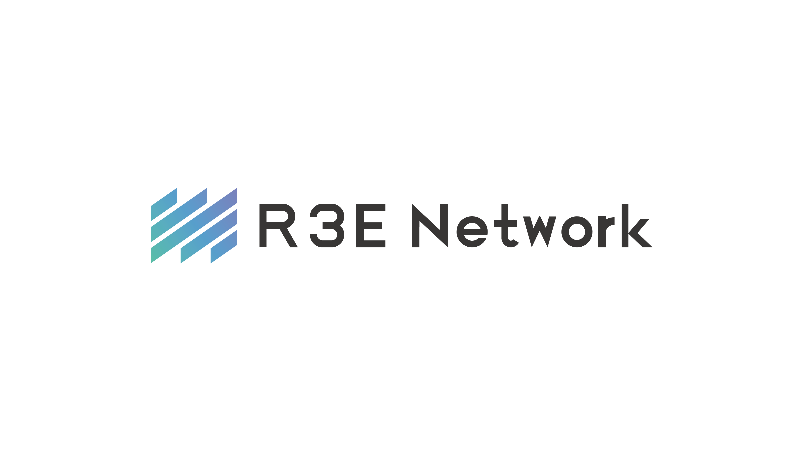

# NeoRust SDK Documentation

  
  
  

Welcome to the NeoRust SDK documentation. This SDK provides a comprehensive set of tools for interacting with the Neo N3 blockchain using Rust.

## Features

- **Wallet Management**: Create, load, and manage Neo wallets
- **Transaction Building**: Build and sign transactions
- **Smart Contract Interaction**: Deploy and invoke smart contracts
- **NEP-17 Token Support**: Interact with NEP-17 tokens
- **NNS Integration**: Work with the Neo Name Service
- **Famous Contract Support**: Direct interfaces for Flamingo, NeoburgerNeo, GrandShare, and NeoCompound
- **Neo X Support**: EVM compatibility and bridge functionality
- **SGX Support**: Secure operations within Intel SGX enclaves

## Getting Started

To get started with the NeoRust SDK, see the [Getting Started Guide](guides/getting-started.md).

## API Reference

For detailed API documentation, see the [API Reference](reference/api-overview.md).

## Examples

Check out the [Examples](examples/README.md) section for code examples demonstrating various features of the SDK.
